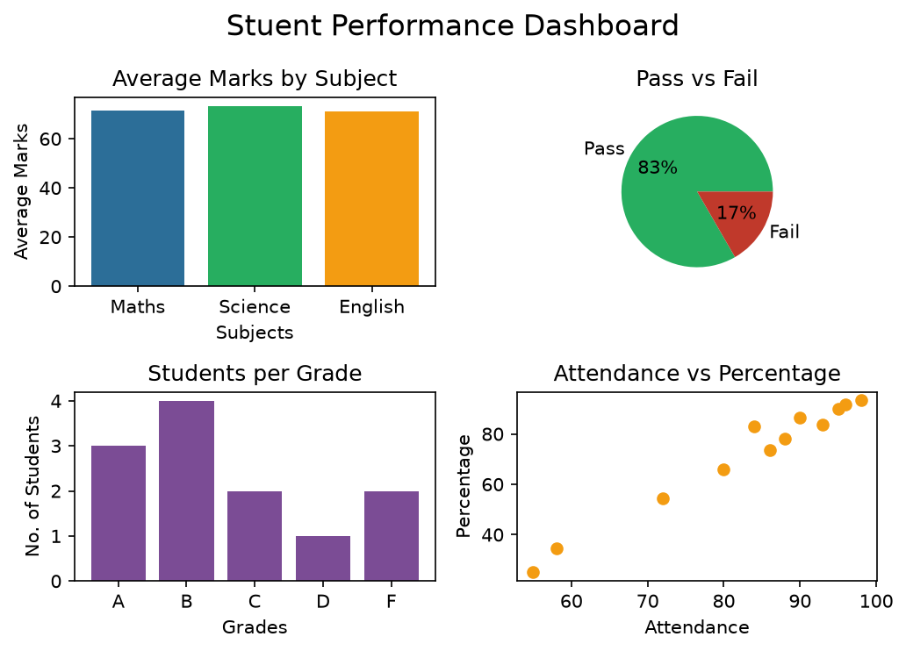

# Student Performance Analysis 📊

## 📌 Question
How are students performing academically, and how do attendance, 
and subject scores relate to overall percentage?
Also build a Pass/Fail predictor.

## 📁 Dataset Overview
- 12 students, 12 columns
- Ages 15–18, across 6 cities, Classes 10 & 12

## ✅ Data Quality
- No missing values
- Consistent data types

## Charts

## 📈 Key Findings
| Metric | Value |
|---|---|
| Total Students | 12 |
| Pass / Fail | 10 / 2 |
| Avg Percentage | 71.64% |
| Highest % | 93.3% (Fatima) |
| Lowest % | 25.0% (Vikram) |
| Avg Attendance | 82.92% |
- Science has the hgihest average (73.3) and English has the lowest average,
  gap is small and we can say that class is fairly balanced across three.
- Attendance is the biggest driver of results two low attendance students are far behind

## 🤖 Pass/Fail Predictor (Machine Learning)
Built a simple **Logistic Regression** model to predict whether a student 
will Pass or Fail, based on Attendance and subject marks (Maths, Science, 
English).

- **Model:** Logistic Regression
- **Features:** Attendance, Maths, Science, English
- **Target:** Status (Pass/Fail)
- **Accuracy:** 1.0 (on a small test set)

**Note:** With only 12 rows total and just 2 well-separated classes 
(failing students had noticeably lower marks and attendance than passing 
ones), the model achieves perfect accuracy on this test set. This 
reflects how clearly separated the two groups are in this dataset, 
rather than proof the model would generalize this well on a larger, 
more varied dataset.

## 💡 Recommendations
- Monitor students below 70% attendance
- Extra support for students scoring under 50%

## Conclusion
A mostly strong Class, with a clear, fixable attendance problem in small group.

## 🛠️ Tech Used
Python, Pandas, Machine Learning, Scikit-learn